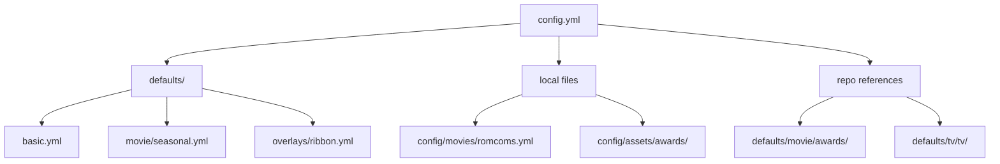
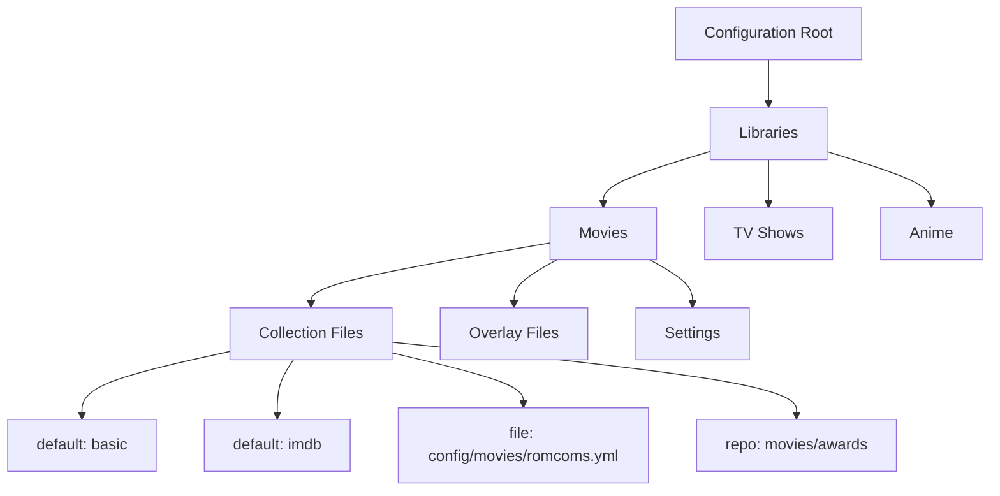
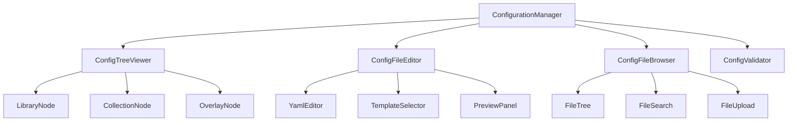
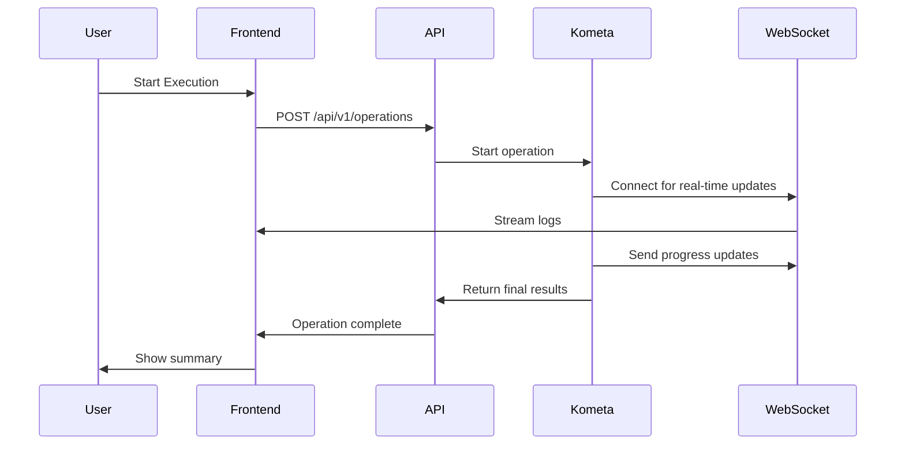

# 🎯 Kometa Configuration Visualization & Execution Monitoring Plan

## 📋 Table of Contents

1. [Current Configuration Structure Analysis](#1-current-configuration-structure-analysis)
2. [Configuration Visualization Requirements](#2-configuration-visualization-requirements)
3. [Backend API Enhancements](#3-backend-api-enhancements)
4. [Frontend Implementation Plan](#4-frontend-implementation-plan)
5. [Execution Monitoring System](#5-execution-monitoring-system)
6. [Error Handling & Recovery](#6-error-handling--recovery)
7. [Implementation Roadmap](#7-implementation-roadmap)

---

## 1. Current Configuration Structure Analysis

### 1.1 Main Configuration File Structure (`config.yml`)

```yaml
libraries:
  Movies:
    collection_files:
      - default: basic
      - default: imdb
      - file: config/movies/romcoms.yml
      - repo: movies/awards
        asset_directory: config/assets/awards
    overlay_files:
      - default: ribbon
    remove_overlays: false
  TV Shows:
    collection_files:
      - default: basic
      - default: imdb
      - repo: tv/tv
        asset_directory: config/assets/collections
    overlay_files:
      - default: ribbon
    remove_overlays: false
```

### 1.2 Collection File Structure Analysis

#### File Reference Types
1. **Default References**: `default: basic` - Points to files in `defaults/` directory
2. **Local File References**: `file: config/movies/romcoms.yml` - Direct file paths
3. **Repository References**: `repo: movies/awards` - Points to directories in `defaults/`

#### Collection File Structure Example
```yaml
collections:
  "Romantic Comedies":
    imdb_list:
      - url: https://www.imdb.com/list/ls012345678/
        limit: 50
    sort_by: title.asc
    sync_mode: sync

  "Award Winners":
    tmdb_collection:
      - 12345  # Academy Awards
      - 67890  # Golden Globes
    overlay:
      path: config/assets/awards/oscars.png
      position: top_right
```

### 1.3 Configuration File Locations



---

## 2. Configuration Visualization Requirements

### 2.1 Visualization Goals

1. **Hierarchical View**: Display configuration structure with expandable nodes
2. **File Content Preview**: Show collection file contents with syntax highlighting
3. **Dependency Mapping**: Visualize relationships between config files
4. **Edit Capabilities**: Modify configuration parameters and file references
5. **Validation**: Real-time YAML validation and error detection

### 2.2 Required Visualization Components

#### Configuration Tree Viewer


#### Collection File Editor Requirements
- **Syntax Highlighting**: YAML-specific highlighting
- **Auto-completion**: For common Kometa parameters
- **Template Support**: Predefined collection templates
- **Validation**: Schema-based validation
- **Preview**: Visual preview of collection structure

---

## 3. Backend API Enhancements

### 3.1 New API Endpoints Required

#### Configuration Structure Endpoints
| Endpoint | Method | Description | Response Format |
|----------|--------|-------------|-----------------|
| `/api/v1/config/structure` | GET | Get complete config structure | JSON tree |
| `/api/v1/config/files` | GET | List all referenced files | File list with metadata |
| `/api/v1/config/file-content` | GET | Get file content | YAML/JSON |

#### File Management Endpoints
| Endpoint | Method | Description | Request/Response |
|----------|--------|-------------|------------------|
| `/api/v1/config/files` | POST | Create new config file | File content |
| `/api/v1/config/files/{path}` | PUT | Update config file | File content |
| `/api/v1/config/files/{path}` | DELETE | Delete config file | Confirmation |
| `/api/v1/config/validate` | POST | Validate config | Validation results |

### 3.2 API Implementation Details

#### Configuration Structure Endpoint
```python
# routers/config.py
@router.get("/structure")
async def get_config_structure():
    """Return hierarchical structure of configuration"""
    config = ConfigFile.load_config()
    structure = {
        "libraries": {},
        "playlists": config.get("playlist_files", []),
        "settings": {k: v for k, v in config.items()
                    if k not in ["libraries", "playlist_files"]}
    }

    for lib_name, lib_config in config.get("libraries", {}).items():
        structure["libraries"][lib_name] = {
            "collection_files": lib_config.get("collection_files", []),
            "overlay_files": lib_config.get("overlay_files", []),
            "metadata_files": lib_config.get("metadata_files", []),
            "settings": {k: v for k, v in lib_config.items()
                        if k not in ["collection_files", "overlay_files", "metadata_files"]}
        }

    return structure
```

#### File Content Endpoint
```python
@router.get("/file-content")
async def get_file_content(path: str):
    """Return content of configuration file"""
    try:
        full_path = resolve_config_path(path)
        with open(full_path, 'r') as f:
            content = f.read()
        return {"path": path, "content": content, "type": "yaml"}
    except FileNotFoundError:
        raise HTTPException(status_code=404, detail="File not found")
```

### 3.3 File Resolution Logic

```python
def resolve_config_path(reference: str) -> str:
    """Resolve file references to actual paths"""
    if reference.startswith("default:"):
        # Handle default references
        default_name = reference.split(":")[1].strip()
        return find_default_file(default_name)
    elif reference.startswith("file:"):
        # Handle local file references
        return reference.split(":", 1)[1].strip()
    elif reference.startswith("repo:"):
        # Handle repository references
        repo_path = reference.split(":", 1)[1].strip()
        return find_repo_files(repo_path)
    else:
        raise ValueError(f"Unknown reference type: {reference}")
```

---

## 4. Frontend Implementation Plan

### 4.1 Component Architecture



### 4.2 React Component Implementation

#### Configuration Tree Viewer
```tsx
// src/features/config/ConfigTreeViewer.tsx
const ConfigTreeViewer = () => {
  const { data: structure } = useGetConfigStructureQuery();
  const [expandedNodes, setExpandedNodes] = useState<string[]>([]);

  const toggleNode = (path: string) => {
    setExpandedNodes(prev =>
      prev.includes(path) ? prev.filter(p => p !== path) : [...prev, path]
    );
  };

  const renderLibrary = (libName: string, libConfig: any) => (
    <TreeItem
      nodeId={`libraries.${libName}`}
      label={libName}
      onClick={() => toggleNode(`libraries.${libName}`)}
    >
      <TreeItem nodeId={`collections`} label="Collection Files">
        {libConfig.collection_files.map((file: any, index: number) => (
          <CollectionFileNode
            key={index}
            reference={file}
            library={libName}
          />
        ))}
      </TreeItem>
      <TreeItem nodeId={`overlays`} label="Overlay Files">
        {libConfig.overlay_files.map((file: any, index: number) => (
          <OverlayFileNode
            key={index}
            reference={file}
            library={libName}
          />
        ))}
      </TreeItem>
    </TreeItem>
  );

  return (
    <TreeView>
      {structure?.libraries && Object.entries(structure.libraries).map(
        ([name, config]) => renderLibrary(name, config)
      )}
    </TreeView>
  );
};
```

#### Collection File Node
```tsx
const CollectionFileNode = ({ reference, library }: { reference: any, library: string }) => {
  const [content, setContent] = useState<string | null>(null);
  const { data: fileContent } = useGetFileContentQuery(
    typeof reference === 'string' ? reference : reference.file || reference.repo
  );

  const handleClick = () => {
    if (typeof reference === 'string') {
      // Simple reference
      setContent(fileContent?.content || null);
    } else {
      // Complex reference with asset_directory
      setContent(fileContent?.content || null);
    }
  };

  const getLabel = () => {
    if (typeof reference === 'string') {
      return reference;
    } else if (reference.file) {
      return `File: ${reference.file}`;
    } else if (reference.repo) {
      return `Repo: ${reference.repo} (${reference.asset_directory})`;
    }
    return 'Unknown';
  };

  return (
    <TreeItem
      nodeId={`${library}.${getLabel()}`}
      label={getLabel()}
      onClick={handleClick}
    >
      {content && (
        <div className="file-preview">
          <YamlEditor value={content} readOnly />
        </div>
      )}
    </TreeItem>
  );
};
```

### 4.3 YAML Editor Integration

```tsx
// src/features/config/YamlEditor.tsx
const YamlEditor = ({ value, onChange, readOnly = false }) => {
  const editorRef = useRef(null);
  const [validationErrors, setValidationErrors] = useState<string[]>([]);

  useEffect(() => {
    if (editorRef.current) {
      const editor = monaco.editor.create(editorRef.current, {
        value: value || '',
        language: 'yaml',
        theme: 'vs-dark',
        readOnly: readOnly,
        minimap: { enabled: false },
        automaticLayout: true
      });

      editor.onDidChangeModelContent(() => {
        if (!readOnly && onChange) {
          onChange(editor.getValue());
        }
      });

      return () => editor.dispose();
    }
  }, [value, readOnly]);

  const validateYaml = async () => {
    try {
      const result = await validateConfigYaml(value);
      setValidationErrors(result.errors || []);
      return result.valid;
    } catch (error) {
      setValidationErrors([error.message]);
      return false;
    }
  };

  return (
    <div className="yaml-editor-container">
      <div ref={editorRef} className="yaml-editor" />
      {validationErrors.length > 0 && (
        <div className="validation-errors">
          {validationErrors.map((error, index) => (
            <Alert key={index} severity="error">{error}</Alert>
          ))}
        </div>
      )}
      {!readOnly && (
        <Button onClick={validateYaml} variant="contained">
          Validate YAML
        </Button>
      )}
    </div>
  );
};
```

---

## 5. Execution Monitoring System

### 5.1 Real-time Execution Architecture



### 5.2 Execution Monitoring Components

#### Operation Status Dashboard
```tsx
const OperationDashboard = () => {
  const [operationId, setOperationId] = useState<string | null>(null);
  const [logs, setLogs] = useState<string[]>([]);
  const [status, setStatus] = useState<'idle' | 'running' | 'completed' | 'failed'>('idle');
  const [progress, setProgress] = useState<number>(0);
  const [errors, setErrors] = useState<string[]>([]);
  const [socket, setSocket] = useState<WebSocket | null>(null);

  const startOperation = async () => {
    try {
      const response = await startKometaOperation();
      setOperationId(response.operation_id);
      setStatus('running');
      setLogs([]);
      setErrors([]);

      // Connect to WebSocket
      const ws = new WebSocket(`ws://localhost:8000/api/v1/operations/${response.operation_id}/ws`);
      setSocket(ws);

      ws.onmessage = (event) => {
        const data = JSON.parse(event.data);
        if (data.type === 'log') {
          setLogs(prev => [...prev, data.message]);
        } else if (data.type === 'progress') {
          setProgress(data.percentage);
        } else if (data.type === 'error') {
          setErrors(prev => [...prev, data.message]);
        } else if (data.type === 'status') {
          setStatus(data.status);
        }
      };

      ws.onclose = () => {
        if (status === 'running') {
          setStatus('completed');
        }
      };

    } catch (error) {
      setStatus('failed');
      setErrors([error.message]);
    }
  };

  const cancelOperation = () => {
    if (socket) {
      socket.close();
    }
    cancelKometaOperation(operationId);
    setStatus('idle');
  };

  return (
    <div className="operation-dashboard">
      <div className="controls">
        <Button
          onClick={startOperation}
          disabled={status === 'running'}
          variant="contained"
          color="primary"
        >
          {status === 'running' ? 'Running...' : 'Start Operation'}
        </Button>
        <Button
          onClick={cancelOperation}
          disabled={status !== 'running'}
          variant="contained"
          color="secondary"
        >
          Cancel
        </Button>
      </div>

      <div className="status-indicator">
        <CircularProgress variant="determinate" value={progress} />
        <Typography>{Math.round(progress)}% Complete</Typography>
        <Chip
          label={status.toUpperCase()}
          color={
            status === 'running' ? 'primary' :
            status === 'completed' ? 'success' :
            status === 'failed' ? 'error' : 'default'
          }
        />
      </div>

      <div className="log-viewer">
        <Typography variant="h6">Real-time Logs</Typography>
        <div className="logs-container">
          {logs.map((log, index) => (
            <div key={index} className="log-entry">
              {log}
            </div>
          ))}
        </div>
      </div>

      {errors.length > 0 && (
        <div className="error-panel">
          <Typography variant="h6" color="error">Errors Encountered</Typography>
          {errors.map((error, index) => (
            <Alert key={index} severity="error" className="error-message">
              {error}
            </Alert>
          ))}
        </div>
      )}
    </div>
  );
};
```

### 5.3 Backend Execution Endpoints

```python
# routers/operations.py
@router.post("/operations")
async def start_operation(
    libraries: Optional[List[str]] = None,
    collections: Optional[List[str]] = None
):
    """Start Kometa operation"""
    operation_id = str(uuid.uuid4())
    operation_data = {
        "id": operation_id,
        "status": "queued",
        "start_time": datetime.now().isoformat(),
        "libraries": libraries or [],
        "collections": collections or [],
        "logs": [],
        "errors": []
    }

    # Store operation in database
    db.operations.insert(operation_data)

    # Start operation in background
    asyncio.create_task(run_operation_background(operation_id))

    return {"operation_id": operation_id, "status": "started"}

async def run_operation_background(operation_id: str):
    """Run operation in background and stream updates"""
    operation = db.operations.find_one({"id": operation_id})
    operation["status"] = "running"
    db.operations.update({"id": operation_id}, operation)

    try:
        # Run Kometa with specified parameters
        result = run_kometa_operation(
            libraries=operation["libraries"],
            collections=operation["collections"]
        )

        # Update operation with results
        operation.update({
            "status": "completed",
            "end_time": datetime.now().isoformat(),
            "result": result
        })
        db.operations.update({"id": operation_id}, operation)

    except Exception as e:
        operation.update({
            "status": "failed",
            "end_time": datetime.now().isoformat(),
            "error": str(e)
        })
        db.operations.update({"id": operation_id}, operation)
```

---

## 6. Error Handling & Recovery

### 6.1 Error Classification System

| Error Type | Severity | Handling Strategy |
|------------|----------|-------------------|
| **Configuration Errors** | High | Prevent execution, show validation errors |
| **API Errors** | Medium | Retry with exponential backoff |
| **File System Errors** | High | Show user-friendly error messages |
| **Network Errors** | Medium | Retry or show offline mode |
| **Execution Errors** | High | Capture in logs, allow partial recovery |

### 6.2 Error Recovery Strategies

#### Configuration Error Handling
```typescript
const handleConfigError = (error: any) => {
  if (error.code === 'YAML_PARSE_ERROR') {
    // Show syntax error with line number
    toast.error(`YAML Syntax Error on line ${error.line}: ${error.message}`);
    // Highlight error in editor
    editor.setPosition({ lineNumber: error.line, column: error.column });
  } else if (error.code === 'INVALID_REFERENCE') {
    // Show invalid file reference
    toast.error(`Invalid reference: ${error.reference}`);
  } else {
    // Generic error handling
    toast.error(`Configuration error: ${error.message}`);
  }
};
```

#### Execution Error Recovery
```typescript
const handleExecutionError = (error: any, operationId: string) => {
  if (error.type === 'PARTIAL_FAILURE') {
    // Allow partial results
    toast.warning(`Operation completed with some errors. Check logs for details.`);
    // Show recovery options
    setShowRecoveryOptions(true);
  } else if (error.type === 'NETWORK_ERROR') {
    // Offer retry
    toast.error(`Network error occurred. Operation paused.`);
    setCanRetry(true);
  } else {
    // Complete failure
    toast.error(`Operation failed: ${error.message}`);
    setStatus('failed');
  }

  // Always capture error in logs
  logError(error);
};
```

---

## 7. Implementation Roadmap

### 7.1 Phase 1: Backend API Enhancements (2 weeks)

| Task | Duration | Dependencies |
|------|----------|--------------|
| Implement config structure endpoint | 2 days | None |
| Add file content resolution | 3 days | Structure endpoint |
| Create file management endpoints | 3 days | Content resolution |
| Implement validation API | 2 days | File management |
| Add execution monitoring endpoints | 3 days | None |
| WebSocket integration | 2 days | Execution endpoints |

### 7.2 Phase 2: Frontend Configuration Visualization (3 weeks)

| Task | Duration | Dependencies |
|------|----------|--------------|
| Configuration tree viewer | 4 days | Backend APIs |
| YAML editor integration | 3 days | Tree viewer |
| File browser component | 3 days | YAML editor |
| Template system | 2 days | File browser |
| Validation system | 2 days | YAML editor |
| Configuration diff tool | 3 days | All above |

### 7.3 Phase 3: Execution Monitoring (2 weeks)

| Task | Duration | Dependencies |
|------|----------|--------------|
| Operation dashboard | 3 days | Backend execution APIs |
| Real-time log viewer | 3 days | WebSocket integration |
| Progress tracking | 2 days | Operation dashboard |
| Error handling UI | 2 days | Progress tracking |
| Recovery options | 2 days | Error handling |

### 7.4 Phase 4: Integration & Testing (2 weeks)

| Task | Duration | Dependencies |
|------|----------|--------------|
| End-to-end testing | 4 days | All components |
| Performance optimization | 3 days | E2E testing |
| Security review | 2 days | Optimization |
| Documentation | 3 days | Security review |
| User acceptance testing | 2 days | Documentation |

### 7.5 Total Estimated Timeline: 9 weeks

---

## 🎯 Summary

This comprehensive plan outlines the complete implementation strategy for enhancing the Kometa web interface to support:

1. **Configuration Visualization**: Hierarchical tree view of configuration structure
2. **File Content Management**: Viewing and editing YAML configuration files
3. **Execution Monitoring**: Real-time operation tracking with WebSocket updates
4. **Error Handling**: Comprehensive error capture and recovery options

The implementation follows a phased approach, ensuring each component is thoroughly tested before integration. The final system will provide users with a powerful, visual interface for managing Kometa configurations and monitoring execution results.