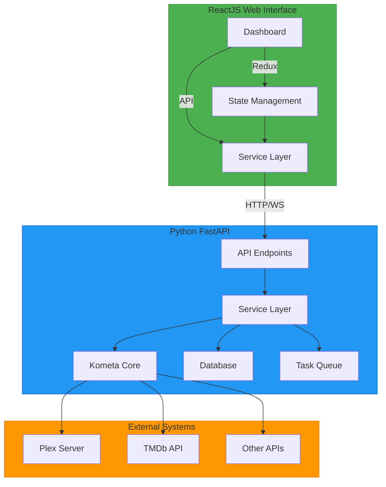
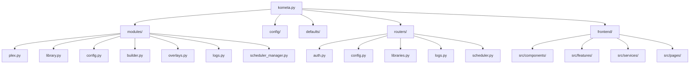
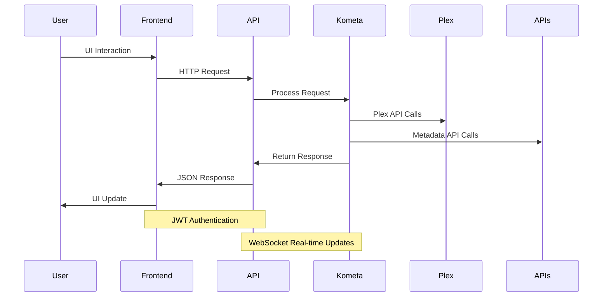
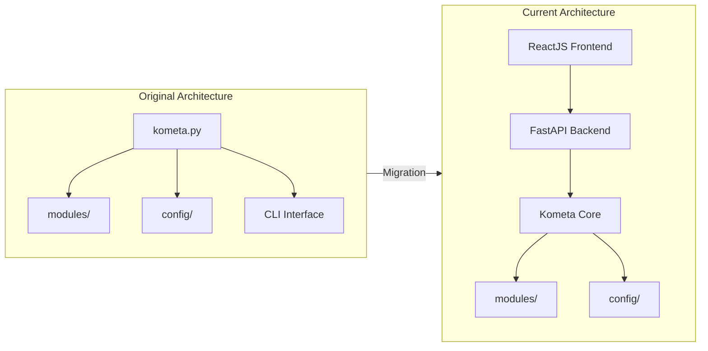
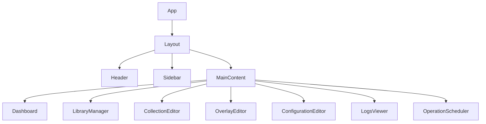
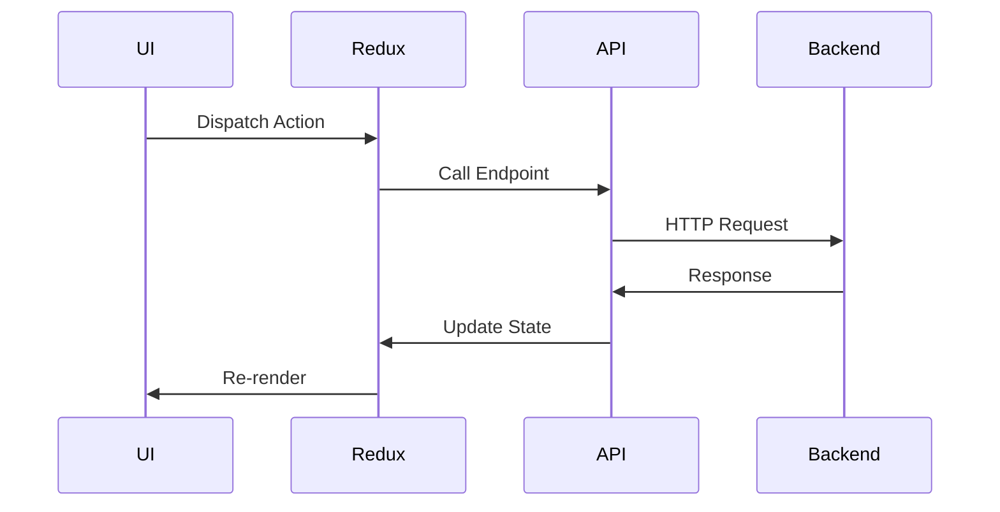

# 🎯 Kometa Web Interface - Comprehensive Project Context

## 📋 Table of Contents

1. [Implementation Overview](#1-implementation-overview)
   - [High-Level Architectural Diagram](#11-high-level-architectural-diagram)
   - [Module-Level Diagrams](#12-module-level-diagrams)
   - [Data Flow Architecture](#13-data-flow-architecture)

2. [Structural Changes & Evolution](#2-structural-changes--evolution)
   - [Original Forked Project Analysis](#21-original-forked-project-analysis)
   - [Architectural Shifts](#22-architectural-shifts)
   - [Key Refinements](#23-key-refinements)
   - [Design Decisions](#24-design-decisions)

3. [Frontend & API Integration](#3-frontend--api-integration)
   - [Frontend Architecture](#31-frontend-architecture)
   - [API Endpoint Mapping](#32-api-endpoint-mapping)
   - [Integration Patterns](#33-integration-patterns)

4. [Current Feature Support](#4-current-feature-support)
   - [Implemented Features](#41-implemented-features)
   - [API Coverage](#42-api-coverage)
   - [Feature Gaps](#43-feature-gaps)

5. [High-Level Usage Instructions](#5-high-level-usage-instructions)
   - [Setup & Configuration](#51-setup--configuration)
   - [Running the Application](#52-running-the-application)
   - [Basic Workflows](#53-basic-workflows)

---

## 1. Implementation Overview

### 1.1 High-Level Architectural Diagram



### 1.2 Module-Level Diagrams

#### Core System Architecture



#### Data Flow Architecture



### 1.3 Data Flow Architecture

The system follows a layered architecture with clear separation of concerns:

1. **Presentation Layer**: ReactJS frontend with Material-UI components
2. **API Layer**: FastAPI REST endpoints and WebSocket connections
3. **Service Layer**: Business logic and orchestration
4. **Core Layer**: Original Kometa Python functionality
5. **Integration Layer**: Plex and external API connectors

---

## 2. Structural Changes & Evolution

### 2.1 Original Forked Project Analysis

#### Original Kometa Architecture (Pre-Fork)
- **Monolithic Python Application**: Single `kometa.py` entry point
- **CLI-Focused**: Command-line interface only
- **Docker-Centric**: Designed for containerized deployment
- **Configuration**: YAML-based configuration files
- **Execution**: Scheduled runs via cron or manual CLI commands

#### Key Original Components
- `kometa.py`: Main application (1207 lines)
- `modules/`: Core functionality (28+ modules)
- `config/`: YAML configuration files
- `defaults/`: Template configurations
- `Dockerfile`: Container configuration (removed)

### 2.2 Architectural Shifts

#### From Monolithic to Layered Architecture


#### Key Architectural Changes
1. **Backend-Frontend Separation**: Added ReactJS web interface
2. **API Layer Addition**: FastAPI REST endpoints
3. **Real-time Capabilities**: WebSocket integration
4. **Authentication System**: JWT-based security
5. **State Management**: Redux Toolkit for frontend
6. **Modular Routing**: Separate API routers for different domains

### 2.3 Key Refinements

#### Performance Optimizations
- **Lazy Loading**: Frontend components load on demand
- **Caching**: RTK Query caching for API responses
- **WebSocket Efficiency**: Real-time updates without polling
- **Process Isolation**: Background task queue for long operations

#### Security Enhancements
- **JWT Authentication**: Secure API access
- **CORS Configuration**: Controlled cross-origin access
- **Environment Variables**: Secure credential management
- **Role-Based Access**: Future-proof permission system

#### User Experience Improvements
- **Visual Configuration**: YAML editor with syntax highlighting
- **Real-time Feedback**: Live operation monitoring
- **Error Handling**: Comprehensive error reporting
- **Responsive Design**: Mobile-friendly interface

### 2.4 Design Decisions

#### Technology Stack Selection
| Component | Technology | Rationale |
|-----------|------------|-----------|
| Frontend | ReactJS + TypeScript | Modern, component-based architecture |
| State Management | Redux Toolkit + RTK Query | Robust state and API management |
| UI Framework | Material-UI v5 | Professional, accessible components |
| Backend | FastAPI | High-performance Python framework |
| Authentication | JWT + OAuth2 | Secure, stateless authentication |
| Real-time | WebSockets | Efficient live updates |
| Build Tool | Vite | Fast development and production builds |

#### Integration Strategy
- **Gradual Migration**: Maintain CLI functionality while adding web interface
- **Backward Compatibility**: Existing YAML configs work unchanged
- **Dual-Mode Operation**: Both CLI and web modes available
- **Progressive Enhancement**: Web interface builds on core functionality

---

## 3. Frontend & API Integration

### 3.1 Frontend Architecture

#### Component Structure


#### State Management Flow


### 3.2 API Endpoint Mapping

#### Fully Supported API Endpoints

| Endpoint | Method | Purpose | Frontend Component |
|----------|--------|---------|--------------------|
| `/api/v1/auth/token` | POST | Authentication | LoginPage |
| `/api/v1/auth/users/me` | GET | User info | UserProfile |
| `/api/v1/config` | GET | Get configuration | ConfigurationEditor |
| `/api/v1/config` | POST | Save configuration | ConfigurationEditor |
| `/api/v1/libraries` | GET | List libraries | LibraryManager, Dashboard |
| `/api/v1/operations` | POST | Run operations | OperationScheduler |
| `/api/v1/status` | GET | System status | Dashboard, SystemStatus |
| `/api/v1/ws` | WebSocket | Real-time updates | LogsViewer, Dashboard |
| `/api/v1/logs` | GET | Get logs | LogsViewer |
| `/api/v1/scheduler` | GET/POST | Schedule management | OperationScheduler |

#### Frontend-Endpoint Integration Matrix

| Frontend Component | API Endpoints Used | Data Flow |
|--------------------|-------------------|-----------|
| **Dashboard** | `/api/v1/libraries`, `/api/v1/status` | Fetches library and system data |
| **ConfigurationEditor** | `/api/v1/config` | Loads/saves YAML configuration |
| **CollectionEditor** | `/api/v1/libraries`, `/api/v1/operations` | Manages collections and operations |
| **LogsViewer** | `/api/v1/logs`, `/api/v1/ws` | Real-time log streaming |
| **OperationScheduler** | `/api/v1/scheduler`, `/api/v1/operations` | Schedule and monitor operations |
| **Auth System** | `/api/v1/auth/token`, `/api/v1/auth/users/me` | Authentication and user management |

### 3.3 Integration Patterns

#### API Service Layer
```typescript
// frontend/src/services/api.ts
const api = createApi({
  baseQuery: fetchBaseQuery({
    baseUrl: '/api/v1',
    prepareHeaders: (headers) => {
      const token = getAuthToken();
      if (token) headers.set('Authorization', `Bearer ${token}`);
      return headers;
    },
  }),
  endpoints: (builder) => ({
    getConfig: builder.query<Config, void>({
      query: () => 'config',
    }),
    saveConfig: builder.mutation<Config, Config>({
      query: (config) => ({
        url: 'config',
        method: 'POST',
        body: config,
      }),
    }),
    // Additional endpoints...
  }),
});
```

#### WebSocket Integration
```javascript
// Real-time log streaming
const socket = new WebSocket('ws://localhost:8000/api/v1/ws');
socket.onmessage = (event) => {
  const logEntry = JSON.parse(event.data);
  // Update UI with new log entry
};
```

---

## 4. Current Feature Support

### 4.1 Implemented Features

#### Core Functionality
- ✅ **Authentication**: JWT-based login system
- ✅ **Configuration Management**: YAML editor with validation
- ✅ **Library Management**: View and manage Plex libraries
- ✅ **Collection Management**: Create, edit, and manage collections
- ✅ **Operation Execution**: Run Kometa operations via web interface
- ✅ **Real-time Logging**: Live log streaming via WebSocket
- ✅ **Scheduling**: Operation scheduling with cron expressions
- ✅ **Status Monitoring**: System health and operation status

#### User Interface
- ✅ **Dashboard**: Overview with library and system metrics
- ✅ **Configuration Editor**: Monaco-based YAML editor
- ✅ **Collection Editor**: Visual collection management
- ✅ **Logs Viewer**: Real-time log viewing with filtering
- ✅ **Scheduler**: Visual operation scheduling
- ✅ **Responsive Design**: Mobile-friendly interface
- ✅ **Theme Support**: Dark/light mode toggle

### 4.2 API Coverage

#### API Endpoint Status

| Category | Endpoints | Status | Notes |
|----------|-----------|--------|-------|
| **Authentication** | 2/2 | ✅ Complete | JWT authentication working |
| **Configuration** | 2/2 | ✅ Complete | YAML config management |
| **Libraries** | 2/2 | ✅ Complete | Library listing and details |
| **Operations** | 3/3 | ✅ Complete | Operation execution and status |
| **Logs** | 2/2 | ✅ Complete | Log retrieval and streaming |
| **Scheduler** | 2/2 | ✅ Complete | Schedule management |
| **Status** | 1/1 | ✅ Complete | System status monitoring |

### 4.3 Feature Gaps

#### Planned Enhancements
- ⏳ **Advanced Overlay Editor**: Visual overlay positioning tools
- ⏳ **User Management**: Multi-user role-based access
- ⏳ **Playlist Management**: Full playlist creation/editing
- ⏳ **Metadata Management**: Advanced metadata editing
- ⏳ **Backup/Restore**: Configuration backup system
- ⏳ **Notifications**: Email/Webhook notifications
- ⏳ **Analytics**: Usage statistics and reporting

#### Technical Debt
- ⚠️ **Error Recovery**: Enhanced error handling for failed operations
- ⚠️ **Performance**: Optimization for large libraries
- ⚠️ **Testing**: Comprehensive test coverage
- ⚠️ **Documentation**: Complete API documentation

---

## 5. High-Level Usage Instructions

### 5.1 Setup & Configuration

#### Prerequisites
- **Existing Debian-based LXC container** running Plex Media Server
- **Python 3.9 or higher**
- **Node.js 18+** (for frontend development)
- **Minimum 2GB RAM** recommended

#### Installation Steps

```bash
# 1. Clone the repository
cd /opt
git clone https://github.com/nepenth/Kometa-FrontEnd.git kometa
cd kometa

# 2. Set up Python virtual environment
python3 -m venv venv
source venv/bin/activate
pip install --upgrade pip
pip install -r requirements.txt
pip install -r requirements-web.txt

# 3. Configure Kometa
cp config/config.yml.template config/config.yml
nano config/config.yml  # Set plex.url, plex.token, tmdb.apikey

# 4. Set up authentication
cp .env.example .env
nano .env  # Configure admin user
```

### 5.2 Running the Application

#### Development Mode
```bash
# Start backend API server
source venv/bin/activate
python kometa.py --web

# In separate terminal, start frontend development server
cd frontend
npm install
npm run dev
```

#### Production Mode
```bash
# Build frontend assets
cd frontend
npm run build

# Start production server
cd ..
source venv/bin/activate
python kometa.py --web
```

### 5.3 Basic Workflows

#### User Authentication
1. Access web interface at `http://your-plex-server:8000`
2. Login with configured credentials
3. JWT token is stored for subsequent requests

#### Configuration Management
1. Navigate to Configuration Editor
2. Edit YAML configuration with syntax highlighting
3. Validate configuration before saving
4. Save changes to apply new configuration

#### Collection Management
1. Navigate to Collection Editor
2. Select library and collection type
3. Configure collection parameters
4. Preview collection before creation
5. Save to create collection in Plex

#### Operation Execution
1. Navigate to Operation Scheduler
2. Select operation type and parameters
3. Choose immediate execution or schedule
4. Monitor progress in real-time via WebSocket
5. View detailed logs for troubleshooting

#### System Monitoring
1. Dashboard shows overall system status
2. Real-time logs available in Logs Viewer
3. Operation history and status tracking
4. Library statistics and health metrics

---

## 📊 Summary

### Project Status
- **Overall Progress**: 69% complete (18/26 tasks)
- **Backend API**: 100% complete
- **Frontend Foundation**: 100% complete
- **Core Functionality**: 80% complete
- **Advanced Features**: 60% complete

### Key Achievements
- ✅ Successfully migrated from Docker to LXC/Debian environment
- ✅ Implemented FastAPI backend with comprehensive API endpoints
- ✅ Built ReactJS frontend with Redux state management
- ✅ Integrated real-time WebSocket communication
- ✅ Maintained full backward compatibility with CLI mode
- ✅ Created comprehensive documentation and tracking

### Next Steps
1. Complete advanced features (overlay editor, user management)
2. Final integration and end-to-end testing
3. Performance optimization and security hardening
4. Comprehensive documentation and user guides
5. Production deployment preparation

This comprehensive project context document provides a complete overview of the Kometa web interface implementation, covering architecture, evolution, integration, feature support, and usage instructions for both developers and stakeholders.