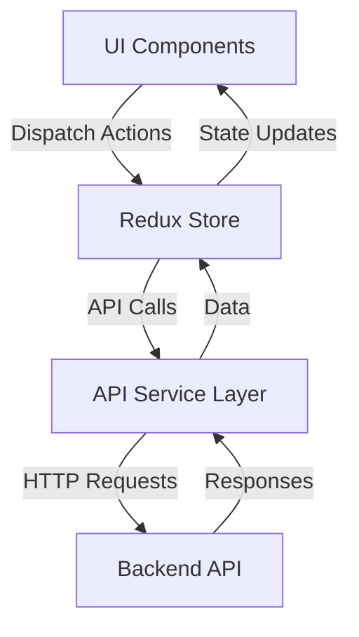
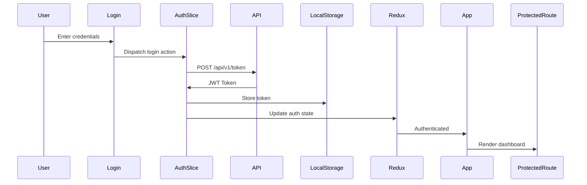

# Kometa Frontend - ReactJS Web Interface

## 🚀 Overview

This is the ReactJS frontend for Kometa Plex Media Manager, providing a modern web interface for managing Plex metadata, collections, and configurations.

## 📋 Project Structure

```
frontend/
├── public/                  # Static assets
├── src/
│   ├── api/                 # API service layer
│   ├── assets/              # Images, icons, etc.
│   ├── components/          # Reusable UI components
│   ├── features/            # Redux feature slices
│   │   ├── auth/            # Authentication
│   │   ├── config/          # Configuration management
│   │   ├── operations/      # Operations execution
│   │   └── status/          # System status monitoring
│   ├── hooks/               # Custom React hooks
│   ├── pages/               # Main application pages
│   ├── store.ts             # Redux store configuration
│   ├── theme.ts             # Material-UI theme
│   ├── App.tsx             # Main application component
│   └── main.tsx            # Entry point
├── .eslintrc.cjs           # ESLint configuration
├── .prettierrc             # Prettier configuration
├── package.json            # Project configuration
├── tsconfig.json           # TypeScript configuration
├── vite.config.ts          # Vite build configuration
└── README.md               # This file
```

## 🎯 Features

### Authentication
- JWT-based authentication with OAuth2 password flow
- Token management with localStorage persistence
- Protected routes and authorization

### Configuration Management
- YAML configuration editor with Monaco Editor
- Real-time validation and syntax highlighting
- Save/load configuration files

### Operations Management
- Execute Kometa operations via API
- Real-time operation status monitoring
- Progress tracking and results display

### System Monitoring
- Real-time status updates via WebSocket
- System health and performance metrics
- Operation history and logs

## 🛠️ Technology Stack

### Core Technologies
- **React 18+** with TypeScript
- **Redux Toolkit** with RTK Query
- **Material-UI v5** for UI components
- **Vite** for build system
- **React Router v6** for navigation

### State Management
- **Redux Toolkit** for global state
- **RTK Query** for API data fetching
- **Zustand** for local component state
- **React Context** for theme and auth

### Development Tools
- **ESLint** with comprehensive rules
- **Prettier** for code formatting
- **Husky** for Git hooks
- **Lint-staged** for pre-commit checks
- **Vitest** for unit testing
- **Storybook** for component development

## 📦 Dependencies

### Production Dependencies
- `@emotion/react`, `@emotion/styled` - CSS-in-JS
- `@mui/material`, `@mui/icons-material` - Material-UI components
- `@reduxjs/toolkit`, `react-redux` - State management
- `axios` - HTTP client
- `formik`, `yup` - Form management and validation
- `i18next`, `react-i18next` - Internationalization
- `jwt-decode` - JWT token decoding
- `monaco-editor` - YAML configuration editor
- `notistack` - Snackbar notifications
- `react`, `react-dom` - React core
- `react-hook-form` - Form hooks
- `react-router-dom` - Routing
- `zustand` - Local state management

### Development Dependencies
- `@storybook/*` - Storybook for component development
- `@testing-library/*` - Testing utilities
- `@types/*` - TypeScript type definitions
- `@vitejs/plugin-react` - Vite React plugin
- `@vitest/coverage-v8` - Test coverage
- `eslint`, `prettier` - Code quality tools
- `husky`, `lint-staged` - Git hooks
- `typescript` - TypeScript
- `vite`, `vite-plugin-svgr` - Build system
- `vitest` - Testing framework

## 🚀 Getting Started

### Prerequisites
- Node.js 18+
- npm 9+
- Kometa backend running on port 8000

### Installation
```bash
cd frontend
npm install
```

### Development
```bash
npm run dev
```
- Starts development server on `http://localhost:3000`
- Proxy configured to backend API at `http://localhost:8000`

### Production Build
```bash
npm run build
```
- Outputs to `../public` directory
- Optimized for production deployment

## 📋 Available Scripts

| Script | Description |
|--------|-------------|
| `npm run dev` | Start development server |
| `npm run build` | Create production build |
| `npm run preview` | Preview production build |
| `npm run lint` | Run ESLint |
| `npm run format` | Run Prettier formatting |
| `npm run test` | Run tests |
| `npm run test:watch` | Run tests in watch mode |
| `npm run test:coverage` | Run tests with coverage |
| `npm run storybook` | Start Storybook |
| `npm run storybook:build` | Build Storybook |

## 🎯 API Integration

### Backend API Endpoints
- **Authentication**: `POST /api/v1/token`
- **Configuration**: `GET/POST /api/v1/config`
- **Operations**: `GET/POST /api/v1/operations`
- **Status**: `GET /api/v1/status`
- **WebSocket**: `ws://localhost:8000/api/v1/ws`

### API Service Layer
The API service layer is located in `src/api/` and provides:
- Axios instance with base configuration
- Request/response interceptors
- Error handling and retries
- Type-safe API calls

## 📊 Redux State Structure

### Store Features
1. **Auth** - Authentication state and user info
2. **Config** - Configuration management
3. **Operations** - Operations execution and monitoring
4. **Status** - System status and health

### State Management Pattern


## 🎨 UI Components

### Component Architecture
- **Atomic Design** pattern
- **Material-UI** based components
- **TypeScript** typed props
- **Storybook** documentation

### Key Components
- **Layout** - Main application layout
- **Dashboard** - Overview and statistics
- **ConfigEditor** - YAML configuration editor
- **CollectionsManager** - Collection management
- **LogsViewer** - Real-time logs
- **Login** - Authentication

## 🔒 Authentication Flow



## 📋 Development Guidelines

### Code Quality
- **ESLint** with strict rules
- **Prettier** for consistent formatting
- **TypeScript** with strict mode
- **Husky** pre-commit hooks

### Commit Messages
- Follow conventional commits
- Use present tense ("Add feature" not "Added feature")
- Reference issues when applicable

### Branch Strategy
- `main` - Production ready code
- `develop` - Integration branch
- `feature/*` - Feature development
- `bugfix/*` - Bug fixes
- `hotfix/*` - Urgent production fixes

## 🎯 Testing Strategy

### Testing Levels
1. **Unit Tests** - Individual components and functions
2. **Integration Tests** - Component interactions
3. **E2E Tests** - User flows and scenarios
4. **API Tests** - Backend API integration

### Test Coverage
- Minimum 80% code coverage
- Critical paths 100% coverage
- Continuous integration testing

## 📊 Performance Optimization

### Build Optimization
- Code splitting with dynamic imports
- Tree shaking for unused code
- Production mode optimizations
- Lazy loading for routes

### Runtime Optimization
- Memoization with `React.memo`
- Virtualization for large lists
- Debounced input handlers
- Efficient state updates

## 🎯 Deployment

### Production Build
```bash
npm run build
```

### Docker Deployment
```dockerfile
FROM node:18-alpine
WORKDIR /app
COPY package*.json ./
RUN npm install
COPY . .
RUN npm run build
```

### Nginx Configuration
```nginx
server {
    listen 80;
    server_name kometa.example.com;

    location / {
        root /app/public;
        try_files $uri /index.html;
    }

    location /api {
        proxy_pass http://backend:8000;
        proxy_set_header Host $host;
        proxy_set_header X-Real-IP $remote_addr;
    }
}
```

## 📋 Roadmap

### Phase 1: Core Functionality
- [x] Authentication system
- [x] Configuration management
- [x] Operations execution
- [x] Status monitoring

### Phase 2: Advanced Features
- [ ] Real-time WebSocket integration
- [ ] Visual operation scheduler
- [ ] Overlay editor with preview
- [ ] Comprehensive logging system

### Phase 3: Polish & Optimization
- [ ] Performance optimization
- [ ] Accessibility improvements
- [ ] Internationalization
- [ ] Advanced theming

## 🎯 Best Practices

### Code Organization
- Feature-based directory structure
- Atomic component design
- Type-safe TypeScript
- Comprehensive documentation

### Security
- JWT token validation
- Secure API communication
- Input validation
- Error boundary handling

### Performance
- Efficient state management
- Optimized re-renders
- Code splitting
- Resource caching

## 📝 License

This frontend is licensed under the same terms as the main Kometa project.