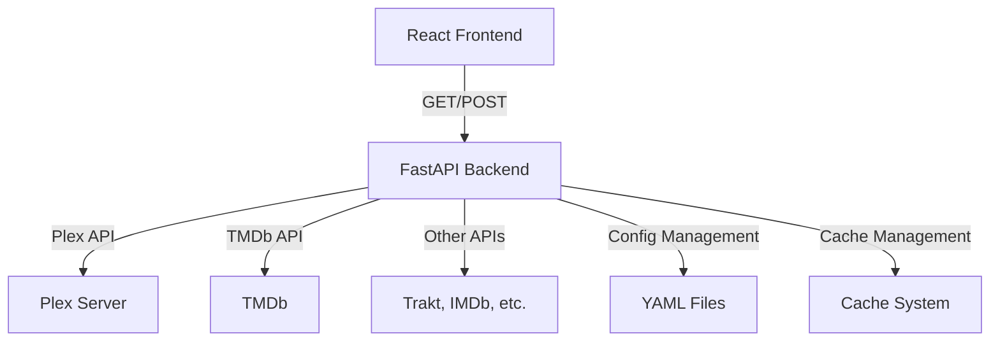

# Kometa Migration & Modernization Project Plan

## Project Overview

This project aims to create a web-based management interface for the existing Kometa Python application, allowing it to run within an existing Plex Media Server LXC container on Debian. The focus is on adding a modern ReactJS frontend while maintaining the core Python functionality.

## Current System Analysis

### Project Structure
- **Core Application**: Python-based Plex metadata manager (`kometa.py`)
- **Dependencies**: 18 Python packages including PlexAPI, requests, ruamel.yaml, etc.
- **Configuration**: YAML-based configuration system with templates
- **Current Deployment**: Docker-based (to be removed for our fork)
- **Documentation**: Extensive MkDocs-based documentation
- **Modules**: 28+ Python modules for various integrations (Plex, TMDb, Trakt, etc.)

### Key Files
- `kometa.py`: Main application entry point (1207 lines)
- `Dockerfile`: Current container configuration (to be replaced)
- `requirements.txt`: Python dependencies
- `config/config.yml.template`: Configuration template
- `modules/`: Core functionality modules

## Migration Plan

### Phase 1: Prepare for Web Interface

#### 1.1 Remove Docker-Specific Configurations ✅ COMPLETED
- **Analysis**: Current Dockerfile uses Python 3-slim, installs system dependencies, and sets up tini
- **Changes Made**:
  - Removed Docker-specific environment variables (`KOMETA_DOCKER`)
  - Updated system version detection to remove Docker references
  - Maintained Linuxserver support for backward compatibility
  - Preserved all core functionality
  - Removed Dockerfile and .dockerignore files

#### 1.2 Create Simple Installation Documentation ✅ COMPLETED
- **Approach**: Simple installation within existing Plex LXC container
- **Deliverables**: Comprehensive README.md with clear instructions
- **Focus**: Minimal setup, easy to follow installation guide

#### 1.3 Create Installation Script for Existing LXC Container
- **Purpose**: Automated setup script for existing Plex LXC container
- **Scope**: Python virtual environment setup, dependency installation, web frontend preparation
- **Deliverables**:
  - `setup_kometa.sh` script for automated installation
  - Directory structure preparation
  - Virtual environment management
  - Dependency installation automation

### Phase 2: Web Interface Development

#### 2.1 Design ReactJS Frontend Architecture
- **Components**: Dashboard, Configuration Editor, Collection Manager, etc.
- **API Design**: RESTful endpoints for frontend-backend communication
- **State Management**: Redux/Context API for application state

#### 2.2 Create API Endpoints for Frontend-Backend Communication
- **Backend Integration**: FastAPI/Flask endpoints in kometa.py
- **Authentication**: JWT-based security for API access
- **Real-time Updates**: WebSocket implementation for live status

#### 2.3 Implement ReactJS Frontend Components
- **Core UI**: Dashboard, configuration editor, collection manager
- **Integration**: Connect frontend to backend API endpoints
- **Testing**: Component testing and user experience validation

### Phase 2: ReactJS Frontend Integration

#### 2.1 Architecture Design
- **Frontend Framework**: ReactJS with TypeScript
- **Backend API**: FastAPI or Flask for Python backend
- **Communication**: RESTful API between frontend and backend
- **State Management**: Redux or Context API

#### 2.2 Key Frontend Components
- **Dashboard**: Overview of libraries and collections
- **Configuration Editor**: YAML configuration management UI
- **Collection Manager**: Visual collection creation and management
- **Overlay Editor**: Drag-and-drop overlay configuration
- **Logs Viewer**: Real-time log viewing and filtering
- **Scheduler**: Visual scheduling interface

#### 2.3 API Endpoints Required


### Phase 3: Implementation Details

#### 3.1 Backend Modifications
- **API Layer**: Add FastAPI endpoints to kometa.py
- **Configuration**: Update config management for API access
- **Authentication**: JWT-based authentication for API
- **WebSocket**: Real-time updates for long-running operations

#### 3.2 Frontend Structure
```
frontend/
├── public/                  # Static assets
├── src/
│   ├── components/          # Reusable components
│   ├── pages/               # Main application pages
│   ├── services/            # API service layer
│   ├── store/               # State management
│   ├── utils/               # Utility functions
│   ├── App.tsx              # Main app component
│   └── index.tsx            # Entry point
├── package.json
└── vite.config.ts           # Build configuration
```

#### 3.3 Integration Points
- **Configuration**: Frontend reads/writes YAML through API
- **Execution**: Frontend triggers backend operations via API
- **Status Monitoring**: WebSocket updates on operation progress
- **Log Streaming**: Real-time log tailing via API

## Technical Requirements

### System Requirements
- **LXC Container**: Debian-based with Python 3.9+
- **Memory**: Minimum 2GB (4GB recommended)
- **Storage**: 500MB+ for application, additional for cache
- **Network**: Access to Plex server and external APIs

### Development Requirements
- **Frontend**: Node.js 18+, npm/yarn
- **Backend**: Python 3.9+, pip
- **Build Tools**: Vite, TypeScript, ESLint
- **Testing**: Jest, React Testing Library

## Implementation Timeline

### Week 1: Migration Preparation
- [ ] Analyze current Docker setup
- [ ] Create LXC/Debian installation scripts
- [ ] Test Python virtual environment setup
- [ ] Update configuration for new environment

### Week 2: Backend API Development
- [ ] Add FastAPI integration to kometa.py
- [ ] Create core API endpoints
- [ ] Implement authentication system
- [ ] Add WebSocket support for real-time updates

### Week 3: Frontend Development
- [ ] Set up ReactJS project structure
- [ ] Implement core UI components
- [ ] Create configuration editor
- [ ] Build dashboard and monitoring views

### Week 4: Integration & Testing
- [ ] Connect frontend to backend API
- [ ] Implement real-time logging
- [ ] Test complete workflow
- [ ] Performance optimization

### Week 5: Documentation & Deployment
- [ ] Create installation guides
- [ ] Write user documentation
- [ ] Update existing docs for new features
- [ ] Final testing and bug fixes

## Risk Assessment

### Potential Risks
1. **Configuration Compatibility**: Existing YAML configs may need adjustments
2. **Performance Impact**: ReactJS frontend may increase resource usage
3. **API Security**: Need proper authentication for sensitive operations
4. **Real-time Updates**: WebSocket implementation complexity

### Mitigation Strategies
1. Maintain backward compatibility with existing configs
2. Implement lazy loading and optimization techniques
3. Use JWT with proper expiration and refresh tokens
4. Start with simple polling, migrate to WebSockets

## Success Criteria

### Minimum Viable Product
- [ ] Kometa runs successfully in LXC/Debian environment
- [ ] Basic ReactJS frontend with configuration editor
- [ ] API endpoints for core operations
- [ ] Real-time log viewing capability

### Full Feature Set
- [ ] Complete UI for all Kometa features
- [ ] Advanced collection and overlay editors
- [ ] Comprehensive error handling and user feedback
- [ ] Full documentation and examples

## Next Steps

1. **Immediate**: Review this plan and provide feedback
2. **Approval**: Once approved, begin Phase 1 implementation
3. **Iterative Development**: Regular check-ins and adjustments
4. **Testing**: Continuous testing throughout development

## Appendix: Key Technical Details

### Current Docker Environment Variables
- `KOMETA_DOCKER=True`
- `BRANCH_NAME=master`
- `TINI_VERSION=v0.19.0`

### Required System Packages (Debian)
- `python3`
- `python3-venv`
- `python3-pip`
- `gcc`
- `g++`
- `libxml2-dev`
- `libxslt-dev`
- `libz-dev`
- `libjpeg62-turbo-dev`
- `zlib1g-dev`

### Python Dependencies (from requirements.txt)
- `arrapi==1.4.14`
- `cloudscraper==1.2.71`
- `GitPython==3.1.45`
- `lxml==6.0.2`
- `num2words==0.5.14`
- `pathvalidate==3.3.1`
- `pillow==11.3.0`
- `PlexAPI==4.17.1`
- `psutil==7.1.0`
- `python-dateutil==2.9.0.post0`
- `python-dotenv==1.1.1`
- `requests==2.32.5`
- `ruamel.yaml==0.18.15`
- `schedule==1.2.2`
- `setuptools==80.9.0`
- `tenacity==9.1.2`
- `tmdbapis==1.2.30`

### Proposed API Endpoints
| Endpoint | Method | Description |
|----------|--------|-------------|
| `/api/config` | GET | Get current configuration |
| `/api/config` | POST | Update configuration |
| `/api/libraries` | GET | List available libraries |
| `/api/collections` | GET | List collections |
| `/api/collections` | POST | Create/update collections |
| `/api/operations` | POST | Run operations |
| `/api/logs` | GET | Get logs (streaming) |
| `/api/status` | GET | Get current status |
| `/api/auth/login` | POST | Authentication |
| `/api/auth/refresh` | POST | Refresh token |