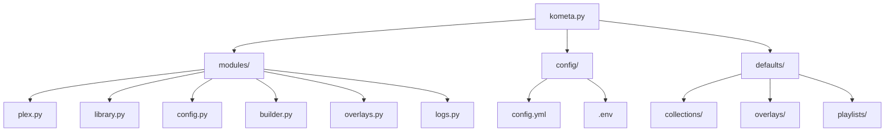
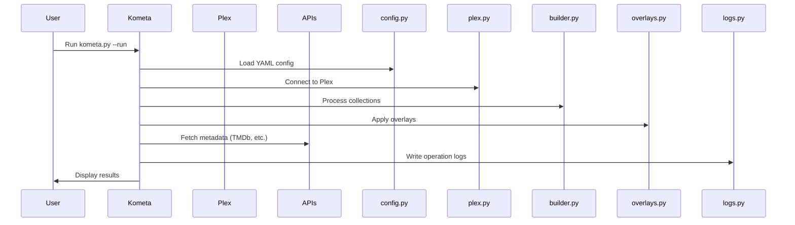
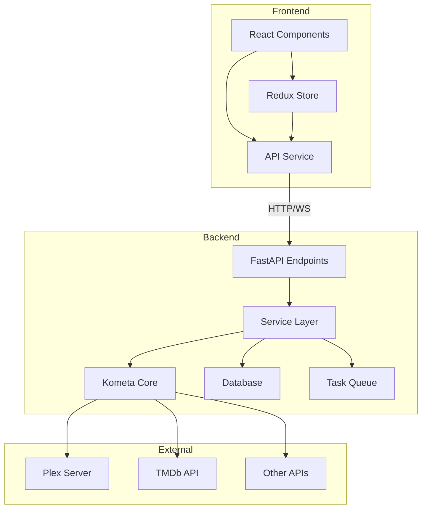
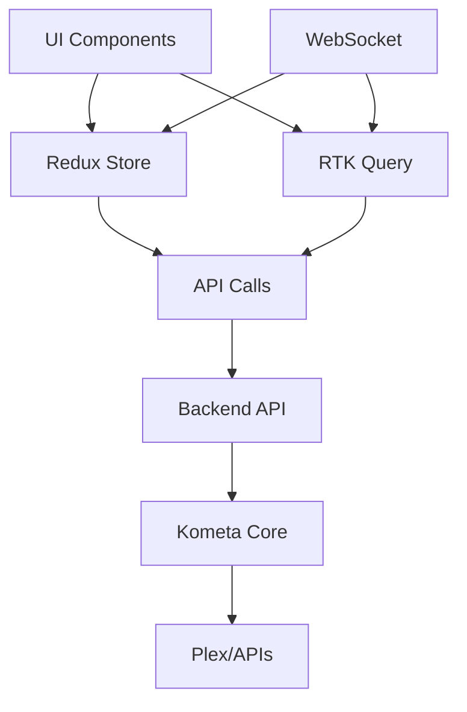
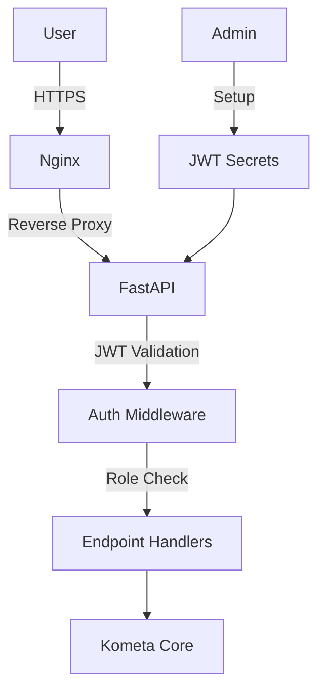
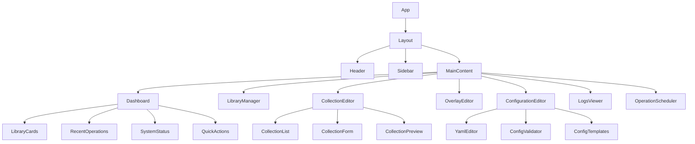
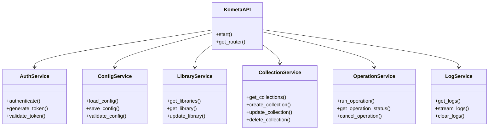
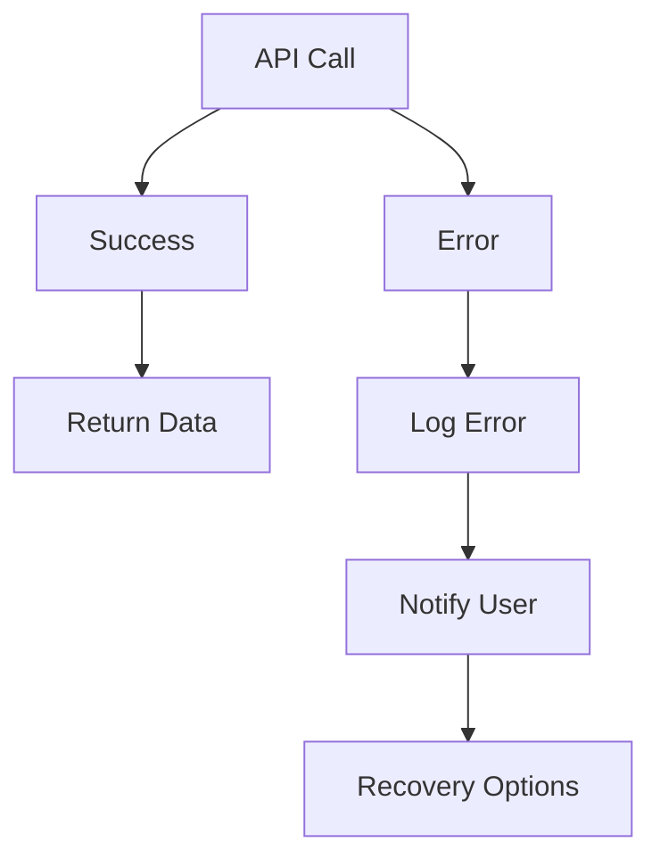
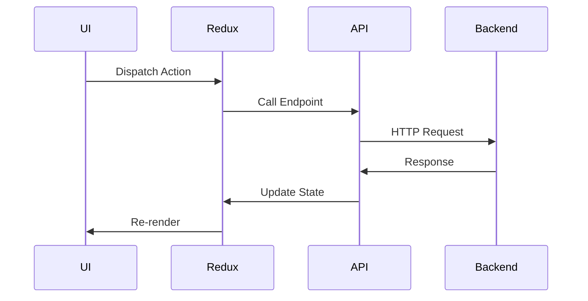

# Kometa Web Interface - Phase 2: Architectural Design & Implementation

## Project Overview

This phase focuses on designing and implementing a modern ReactJS web interface for Kometa that integrates seamlessly with the existing Python backend, providing a user-friendly way to manage Plex metadata and collections through a browser.

## Current Codebase Analysis

### Core Kometa Architecture


### Key Backend Components
1. **Configuration Management**: `modules/config.py` - YAML-based config handling
2. **Plex Integration**: `modules/plex.py` - Plex API communication
3. **Collection Builder**: `modules/builder.py` - Collection creation logic
4. **Overlay System**: `modules/overlays.py` - Overlay management
5. **Logging System**: `modules/logs.py` - Comprehensive logging

### Existing Data Flow


## Architectural Decisions

### 1. Technology Stack Selection

#### Frontend
- **Framework**: ReactJS 18+ with TypeScript
- **State Management**: Redux Toolkit with RTK Query
- **UI Library**: Material-UI (MUI) v5
- **Routing**: React Router v6
- **Build Tool**: Vite 5+
- **Styling**: MUI + CSS Modules

#### Backend
- **API Framework**: FastAPI (Python)
- **Authentication**: JWT with OAuth2
- **Real-time**: WebSockets (FastAPI WebSockets)
- **Database**: SQLite (for web interface state persistence)
- **Task Queue**: Celery + Redis (for long-running operations)

#### Infrastructure
- **Reverse Proxy**: Nginx (for production)
- **Process Manager**: Systemd (for service management)
- **Monitoring**: Prometheus + Grafana (optional)

### 2. Architecture Pattern: Layered Architecture



### 3. API Design: RESTful + Real-time

#### API Endpoint Structure
| Category | Endpoint | Method | Description |
|----------|----------|--------|-------------|
| **System** | `/api/system/status` | GET | System health and status |
| **System** | `/api/system/config` | GET/POST | Global configuration |
| **Libraries** | `/api/libraries` | GET | List all libraries |
| **Libraries** | `/api/libraries/{id}` | GET | Library details |
| **Collections** | `/api/collections` | GET/POST | Collection management |
| **Collections** | `/api/collections/{id}` | GET/PUT/DELETE | Collection CRUD |
| **Overlays** | `/api/overlays` | GET/POST | Overlay management |
| **Operations** | `/api/operations` | POST | Run operations |
| **Logs** | `/api/logs` | GET/WS | Log streaming |
| **Auth** | `/api/auth/login` | POST | Authentication |
| **Auth** | `/api/auth/refresh` | POST | Token refresh |

#### Real-time WebSocket Endpoints
- `/ws/logs` - Real-time log streaming
- `/ws/status` - Operation status updates
- `/ws/notifications` - System notifications

### 4. State Management Strategy



### 5. Security Architecture



## Detailed Component Architecture

### Frontend Component Tree



### Backend Service Architecture



## Implementation Plan

### Phase 2.1: Backend API Development

#### 2.1.1 FastAPI Integration
- **Task**: Integrate FastAPI into kometa.py
- **Approach**: Create API router that wraps existing Kometa functionality
- **Deliverables**:
  - FastAPI app integration
  - CORS and security middleware
  - API documentation with Swagger

#### 2.1.2 Authentication System
- **Task**: Implement JWT-based authentication
- **Approach**: OAuth2 with password flow + JWT tokens
- **Deliverables**:
  - Login endpoint
  - Token validation middleware
  - Role-based access control

#### 2.1.3 Configuration API
- **Task**: Create configuration management endpoints
- **Approach**: Wrap existing YAML config system
- **Deliverables**:
  - GET/POST config endpoints
  - Config validation
  - Template management

### Phase 2.2: Frontend Foundation

#### 2.2.1 ReactJS Project Setup
- **Task**: Complete ReactJS project structure
- **Approach**: Expand existing frontend skeleton
- **Deliverables**:
  - Complete component structure
  - Redux store configuration
  - API service layer
  - Theme and styling system

#### 2.2.2 Core UI Components
- **Task**: Implement core UI components
- **Approach**: Material-UI based components
- **Deliverables**:
  - Layout system
  - Navigation
  - Common UI elements
  - Form components

#### 2.2.3 State Management
- **Task**: Implement Redux + RTK Query
- **Approach**: Slice-based architecture
- **Deliverables**:
  - API slices for each domain
  - Cache management
  - Optimistic updates

### Phase 2.3: Core Functionality

#### 2.3.1 Dashboard Implementation
- **Task**: Create main dashboard
- **Approach**: Widget-based layout
- **Deliverables**:
  - Library overview
  - Operation status
  - Quick actions
  - System metrics

#### 2.3.2 Configuration Editor
- **Task**: Build YAML configuration editor
- **Approach**: Monaco Editor integration
- **Deliverables**:
  - Syntax highlighting
  - Validation
  - Template system
  - Diff viewer

#### 2.3.3 Collection Manager
- **Task**: Implement collection management
- **Approach**: CRUD interface
- **Deliverables**:
  - Collection list
  - Collection editor
  - Preview functionality
  - Bulk operations

### Phase 2.4: Advanced Features

#### 2.4.1 Real-time Monitoring
- **Task**: Implement WebSocket monitoring
- **Approach**: FastAPI WebSockets
- **Deliverables**:
  - Log streaming
  - Operation progress
  - Notification system

#### 2.4.2 Operation Scheduler
- **Task**: Create visual scheduler
- **Approach**: Calendar-based UI
- **Deliverables**:
  - Schedule management
  - Cron expression editor
  - Operation history

#### 2.4.3 Overlay Editor
- **Task**: Build overlay management
- **Approach**: Visual editor
- **Deliverables**:
  - Overlay preview
  - Positioning tools
  - Template system

## Technical Requirements

### Backend Requirements
- **Python**: 3.9+
- **FastAPI**: 0.100+
- **Uvicorn**: For ASGI server
- **SQLite**: For web state persistence
- **Celery**: For background tasks
- **Redis**: For task queue

### Frontend Requirements
- **Node.js**: 18+
- **React**: 18+
- **TypeScript**: 5+
- **Vite**: 5+
- **Material-UI**: 5+
- **Redux Toolkit**: 1.9+

### Development Tools
- **ESLint**: Code quality
- **Prettier**: Code formatting
- **Jest**: Testing
- **Cypress**: E2E testing
- **Docker**: Development environment

## Implementation Timeline

### Week 1: Backend API Foundation
- [ ] Integrate FastAPI into kometa.py
- [ ] Implement authentication system
- [ ] Create configuration API endpoints
- [ ] Set up database for web state
- [ ] Implement basic API documentation

### Week 2: Frontend Foundation
- [ ] Complete ReactJS project structure
- [ ] Implement Redux + RTK Query
- [ ] Create core UI components
- [ ] Build API service layer
- [ ] Implement theme system

### Week 3: Core Functionality
- [ ] Develop main dashboard
- [ ] Build configuration editor
- [ ] Implement collection manager
- [ ] Create library management
- [ ] Add operation controls

### Week 4: Advanced Features
- [ ] Implement real-time monitoring
- [ ] Build operation scheduler
- [ ] Create overlay editor
- [ ] Add log viewer
- [ ] Implement notifications

### Week 5: Integration & Testing
- [ ] Connect frontend to backend
- [ ] Test complete workflow
- [ ] Performance optimization
- [ ] Security testing
- [ ] User experience refinement

## Risk Assessment

### Potential Risks
1. **Performance Impact**: Web interface may increase resource usage
2. **API Security**: Need proper authentication for sensitive operations
3. **Real-time Updates**: WebSocket implementation complexity
4. **Configuration Compatibility**: Existing YAML configs may need adjustments

### Mitigation Strategies
1. **Performance**: Implement lazy loading and optimization techniques
2. **Security**: Use JWT with proper expiration and refresh tokens
3. **Real-time**: Start with simple polling, migrate to WebSockets
4. **Compatibility**: Maintain backward compatibility with existing configs

## Success Criteria

### Minimum Viable Product
- [ ] Kometa runs successfully with web interface
- [ ] Basic ReactJS frontend with configuration editor
- [ ] API endpoints for core operations
- [ ] Real-time log viewing capability
- [ ] Authentication system

### Full Feature Set
- [ ] Complete UI for all Kometa features
- [ ] Advanced collection and overlay editors
- [ ] Comprehensive error handling and user feedback
- [ ] Full documentation and examples
- [ ] Production-ready deployment

## Next Steps

1. **Immediate**: Review this architectural plan and provide feedback
2. **Approval**: Once approved, begin Phase 2.1 implementation
3. **Iterative Development**: Regular check-ins and adjustments
4. **Testing**: Continuous testing throughout development

## Appendix: Key Technical Details

### API Response Standards
```typescript
interface ApiResponse<T> {
  success: boolean;
  data?: T;
  error?: {
    code: string;
    message: string;
    details?: any;
  };
  timestamp: string;
}
```

### Error Handling Strategy


### State Management Flow


This comprehensive architectural plan provides a solid foundation for implementing the Kometa web interface while maintaining compatibility with the existing Python backend and providing a modern, user-friendly management experience.