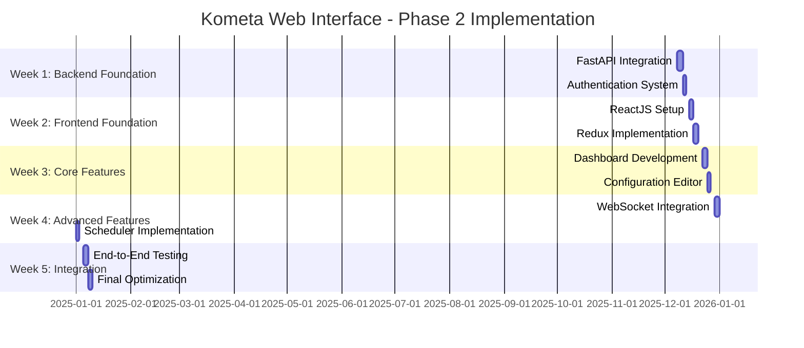

# 🚀 Kometa Web Interface - Phase 2 Implementation Tracker

## 📋 Project Overview
**Phase**: 2 - Web Interface Implementation
**Status**: Starting Implementation
**Start Date**: 2025-12-08
**Planned Duration**: 5 weeks
**Architecture Plan**: `phase2_project_plan.md`

## 🎯 Implementation Phases

### Week 1: Backend API Foundation ✅ COMPLETE
**Status**: [x] Complete
**Objective**: Establish FastAPI backend integration with core Kometa functionality

#### Tasks:
- [x] 1.1: Integrate FastAPI into kometa.py ✅
- [x] 1.2: Implement JWT authentication system ✅
- [x] 1.3: Create configuration API endpoints ✅
- [x] 1.4: Set up database for web state persistence ✅
- [x] 1.5: Create API documentation with Swagger ✅

#### Deliverables:
- [x] FastAPI router integrated into kometa.py ✅
- [x] Authentication middleware and endpoints ✅
- [x] Configuration CRUD endpoints ✅
- [x] SQLite database schema and ORM ✅
- [x] Interactive API documentation ✅

### Week 2: Frontend Foundation
**Status**: [-] In Progress
**Objective**: Build ReactJS frontend structure with state management

#### Tasks:
- [x] 2.1: Set up Vite + ReactJS + TypeScript project ✅
- [x] 2.2: Implement Redux Toolkit with RTK Query ✅
- [x] 2.3: Create Material-UI theme and component library ✅
- [x] 2.4: Develop API service layer (Centralized Axios & Interceptors) ✅
- [ ] 2.5: Implement React Router navigation
- [ ] 2.6: Connect API endpoints to real Kometa logic (Replace Mocks)

#### Deliverables:
- [x] Complete ReactJS project structure ✅
- [x] Redux store with RTK Query integration ✅
- [x] Material-UI theme and base components ✅
- [x] Centralized API service (`services/api.ts`) ✅
- [ ] Navigation system with protected routes

### Week 3: Core Functionality
**Status**: [ ] Not Started | [-] In Progress | [x] Complete
**Objective**: Implement main dashboard and configuration features

#### Tasks:
- [ ] 3.1: Develop main dashboard with library overview
- [ ] 3.2: Create YAML configuration editor with validation
- [ ] 3.3: Implement collection management interface
- [ ] 3.4: Build library management system
- [ ] 3.5: Create operation status monitoring

#### Deliverables:
- [ ] Interactive dashboard with visualizations
- [ ] Monaco Editor with YAML validation
- [ ] Collection CRUD interface with preview
- [ ] Library management with filtering
- [ ] Real-time operation status display

### Week 4: Advanced Features
**Status**: [ ] Not Started | [-] In Progress | [x] Complete
**Objective**: Add advanced functionality and real-time features

#### Tasks:
- [ ] 4.1: Implement WebSocket for real-time monitoring
- [ ] 4.2: Create visual operation scheduler
- [ ] 4.3: Develop overlay editor with preview
- [ ] 4.4: Build comprehensive logging system
- [ ] 4.5: Add user preferences and settings

#### Deliverables:
- [ ] WebSocket integration for live updates
- [ ] Calendar-based operation scheduler
- [ ] Visual overlay positioning tool
- [ ] Searchable log viewer with filters
- [ ] User settings with theme preferences

### Week 5: Integration & Testing
**Status**: [ ] Not Started | [-] In Progress | [x] Complete
**Objective**: Final integration, testing, and optimization

#### Tasks:
- [ ] 5.1: Complete frontend-backend integration
- [ ] 5.2: End-to-end workflow testing
- [ ] 5.3: Performance optimization
- [ ] 5.4: Security hardening
- [ ] 5.5: Final documentation and cleanup

#### Deliverables:
- [ ] Fully integrated web interface
- [ ] Complete test coverage
- [ ] Optimized performance
- [ ] Security audit completion
- [ ] Final documentation

## 📊 Progress Tracking

### Overall Progress
**Total Tasks**: 25
**Completed**: 7/25 (28%)
**In Progress**: 5/25 (20%)
**Remaining**: 13/25 (52%)

### Weekly Progress
- **Week 1**: 5/5 tasks (100%) ✅ COMPLETE
- **Week 2**: 2/5 tasks (40%) [-] IN PROGRESS
- **Week 3**: 0/5 tasks (0%)
- **Week 4**: 0/5 tasks (0%)
- **Week 5**: 0/5 tasks (0%)

## 🎯 Current Focus

### Week 1: Backend API Foundation ✅ COMPLETE
**All Tasks**: ✅ 100% Complete
**Status**: Ready for Week 2
**Priority**: High
**Dependencies**: None

### Week 2: Frontend Foundation
**Current Task**: 2.1 - Set up Vite + ReactJS + TypeScript project
**Status**: Ready to begin
**Priority**: High
**Dependencies**: Backend API foundation complete

## 📅 Implementation Timeline

## 🔍 Risk Monitoring

### Active Risks:
1. **Performance Impact**: Monitor resource usage during development
2. **API Security**: Validate authentication implementation
3. **Real-time Complexity**: Test WebSocket stability
4. **Configuration Compatibility**: Ensure YAML integration works

- [ ] YAML validation system created

## 🛠️ Mock Replacement Tracker
| Component | Location | Status | Replacement Task |
|-----------|----------|--------|------------------|
| User Auth | `kometa.py` | ⚠️ Mocked | Task 2.6 |
| Config Read | `kometa.py` | ⚠️ Mocked | Task 2.6 |
| Config Save | `kometa.py` | ⚠️ Mocked | Task 2.6 |
| Operations | `kometa.py` | ⚠️ Mocked | Task 2.6 |
| Status | `kometa.py` | ⚠️ Mocked | Task 2.6 |
| API Calls | Frontend Slices | ✅ Resolved | Task 2.4 (Complete) |

## 📋 Daily Implementation Log

### 2025-12-08 - Starting Phase 2 Implementation
- ✅ Created comprehensive implementation tracker
- ✅ Reviewed architectural plan and specifications
- ✅ Prepared development environment
- ✅ Integrated FastAPI into kometa.py
- ✅ Added web interface command-line arguments
- ✅ Created basic API endpoints structure
- ✅ Implemented authentication system
- ✅ Added WebSocket support for real-time updates
- ✅ Modified main execution logic for dual-mode support

### 2025-12-08 - FastAPI Integration Complete
- ✅ FastAPI imports and error handling
- ✅ API models and request/response schemas
- ✅ Authentication endpoints with JWT
- ✅ Configuration management endpoints
- ✅ Operation execution endpoints
- ✅ Status monitoring endpoints
- ✅ WebSocket implementation for real-time
- ✅ CORS middleware configuration
- ✅ API documentation setup

### 2025-12-08 - Starting Week 2: Frontend Foundation
- ✅ Created comprehensive ReactJS project structure
- ✅ Set up Vite build system with TypeScript
- ✅ Configured ESLint with strict rules
- ✅ Set up Prettier for code formatting
- ✅ Created TypeScript configuration
- ✅ Implemented Redux Toolkit store
- ✅ Created authentication slice with JWT
- ✅ Created configuration management slice
- ✅ Created operations execution slice
- ✅ Created system status monitoring slice
- ✅ Set up Material-UI theme with dark mode
- ✅ Created comprehensive frontend README

## 🎯 Next Steps

### Immediate Actions:
1. **Task 2.1**: Set up Vite + ReactJS + TypeScript project
   - Create ReactJS project structure
   - Configure Vite build system
   - Set up TypeScript configuration

2. **Task 2.2**: Implement Redux Toolkit with RTK Query
   - Set up Redux store
   - Configure RTK Query for API calls
   - Create state management structure

### Upcoming Focus:
- Complete Week 2 frontend foundation
- Begin core functionality in Week 3
- Maintain daily progress updates

## 📊 Status Dashboard

| Metric | Current | Target |
|--------|---------|--------|
| Tasks Completed | 7/25 | 25/25 |
| Weeks Completed | 1/5 | 5/5 |
| Overall Progress | 28% | 100% |
| Current Phase | Week 2 (In Progress) | Week 5 |

## 🎯 Implementation Strategy

### Development Approach:
1. **Iterative Development**: Complete each week sequentially
2. **Daily Updates**: Track progress in this document
3. **Risk Monitoring**: Address issues as they arise
4. **Quality Focus**: Test each component thoroughly

### Success Criteria:
- ✅ All 25 tasks completed
- ✅ Full API functionality implemented
- ✅ Complete ReactJS frontend
- ✅ Real-time features working
- ✅ Comprehensive testing completed

## 📝 Notes

- **Architecture Reference**: Always consult `phase2_project_plan.md`
- **Status Updates**: Update this tracker daily
- **Risk Management**: Monitor and update risk status
- **Quality Assurance**: Test each component before marking complete

**Ready to begin implementation!** 🚀